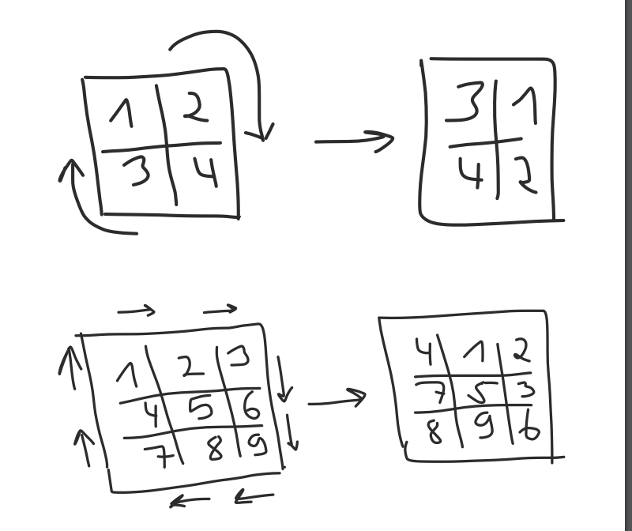

# Matrix-rotation

 Execution covers all table sizes (limited only by javascript engine limitations. To improve this, could be used any library (like `big.js`) that makes calculations by using `String` instead of `Number`). 
 Input data is read by using stream from the .csv file (`input.csv` if you leave the argument empty and don't answer the question) and written to stdout.

# Setup

1) Install packages: run `npm install` in terminal.
2) Create build from ts files: run `npm run build:webpack` in terminal.

# Run
Run `node cli.js input.csv`. in terminal.

# Test
There are several examples of different table sizes. And different input file data (including big one). 
`npm run test`

# Task Description

You should be able to run your program like: 
~ $ node cli.js input.csv > output.csv 
The input file is the first and only argument to the program. Output should be
written to stdout (aka printed to the screen).

**Input** 
The input will be a CSV file with the columns id and json. You can assume id
to be a string and json to be a string (JSON encoded data).  
id,json 
1,"[1, 2, 3, 4, 5, 6, 7, 8, 9]" 
2,"[40, 20, 90, 10]" 
3,"[-5]" 
9,"[2, -0]" 
5,"[2, -5, -5]" 
8,"[1, 1, 1, 1, 1]” 
 **Output** 
The output should be a CSV-encoded series of rotated tables with the
columns id, json and is_valid. The latter is an indicator of whether or not
a given table is valid, if it is not, json should be an empty array.  
id,json,is_valid 
1,"[4, 1, 2, 7, 5, 3, 8, 9, 6]",true 
2,"[90, 40, 10, 20]",true 
3,"[-5]",true 
9,"[]",false 
5,"[]",false 
8,”[]",false 
